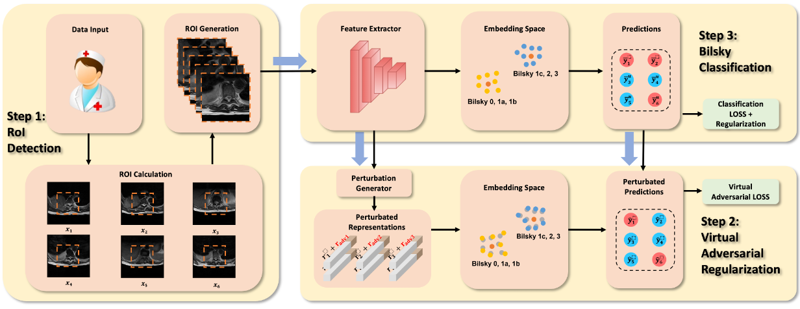

# SpineAI-Bilsky-Grading
<h1 align="center">
  <p align="center">SpineAI Paper with Code</p>
  
</h1>

## Dataset
Coming soon!

## Bilsky-Grading model
An overview of the proposed Bilsky-Grading model.
<div align=center></div>

## Environment

- Python==3.9
- Pytorch==1.9.1
- Keras==2.2.2

## Run the code
bash train.sh

## Training visualization

$ tensorboard --logdir path_to_current_dir/logs

## Results
Internal Test Set
| Normal | Abnormal | Avg Acc |
| ----- | ------ | ------ | 
| 93.58 | 97.62 | 95.6 |


External Test Set
| Normal | Abnormal | Avg Acc |
| ----- | ------ | ------ | 
| 98.12 | 89.94 | 94.03|


## 🤝 Referencing and Citing SpineAI

If you find our work useful in your research and would like to cite our paper, please use the following citation:

```
@article{hallinan2022deep,
  title={Deep Learning Model for Classifying Metastatic Epidural Spinal Cord Compression on MRI},
  author={Hallinan, James Thomas Patrick Decourcy and Zhu, Lei and Zhang, Wenqiao and Lim, Desmond Shi Wei and Baskar, Sangeetha and Low, Xi Zhen and Yeong, Kuan Yuen and Teo, Ee Chin and Kumarakulasinghe, Nesaretnam Barr and Yap, Qai Ven and others},
  journal={Frontiers in Oncology},
  pages={1479},
  year={2022},
  publisher={Frontiers}
}
```

## :mailbox: Contact

Address correspondence to J.T.P.D.H. (e-mail: james_hallinan AT nuhs.edu.sg)

### _Disclaimer_

_This code base is for research purposes and no warranty is provided. We are not responsible for any medical usage of our code._


